# 필수 증거 자료 체크리스트

이 문서는 **「컴퓨터가 알아서 자기 상태를 점검하게 만들기」** 미션의 필수 증거 자료를 GitHub 저장소 기준으로 점검한 결과이다.

> `[x]`는 현재 저장소에서 증거 파일을 확인한 항목이며, `[ ]`는 최종 제출 전에 보완해야 하는 항목이다.

---

## 1. SSH 보안

- [x] SSH 포트 `20022` 변경 확인
- [x] `PermitRootLogin no` 확인
- [x] `sshd`의 TCP `20022` LISTEN 상태 확인

증거:

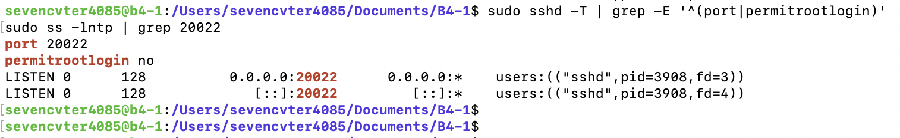

---

## 2. 방화벽

- [x] UFW 활성화 확인
- [x] 기본 인바운드 정책 `deny` 확인
- [x] `20022/tcp` 허용 확인
- [x] `15034/tcp` 허용 확인

증거:

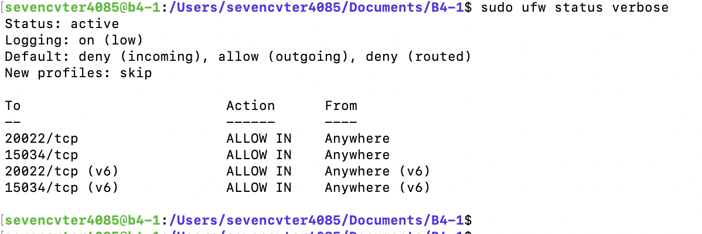

---

## 3. 계정 / 그룹

- [x] `agent-admin` 생성 확인
- [x] `agent-dev` 생성 확인
- [x] `agent-test` 생성 확인
- [x] `agent-common` 구성 확인
- [x] `agent-core` 구성 확인
- [x] `agent-test`가 `agent-core`에 포함되지 않음을 확인

증거:

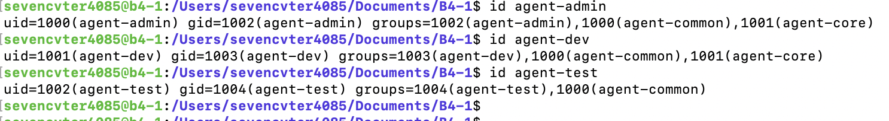

---

## 4. 디렉터리 / 권한 / ACL

- [x] `$AGENT_HOME` 디렉터리 확인
- [x] `$AGENT_HOME/upload_files` 확인
- [x] `$AGENT_HOME/api_keys` 확인
- [x] `$AGENT_HOME/bin` 확인
- [x] `/var/log/agent-app` 확인
- [x] `upload_files`의 `agent-common` 권한 확인
- [x] `api_keys`의 `agent-core` 권한 확인
- [x] `/var/log/agent-app`의 `agent-core` 권한 확인
- [x] ACL 설정 확인
- [x] `agent-test`의 `upload_files` 쓰기 성공 확인
- [x] `agent-test`의 `api_keys` 접근 거부 확인

증거:

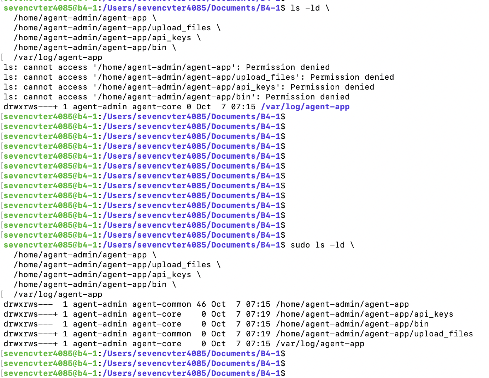

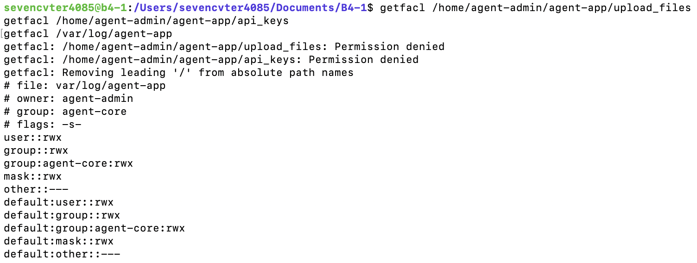

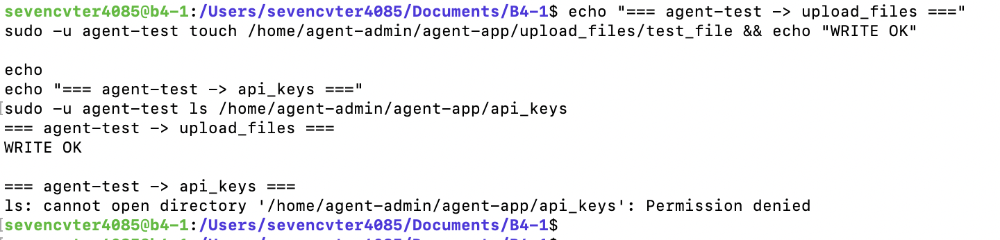

---

## 5. 애플리케이션 실행

- [x] 일반 계정 `agent-admin`으로 실행
- [x] Boot Sequence `[1/5]` `[OK]`
- [x] Boot Sequence `[2/5]` `[OK]`
- [x] Boot Sequence `[3/5]` `[OK]`
- [x] Boot Sequence `[4/5]` `[OK]`
- [x] Boot Sequence `[5/5]` `[OK]`
- [x] `All Boot Checks Passed!` 확인
- [x] `Agent READY` 확인
- [x] `0.0.0.0:15034` LISTEN 확인

증거:

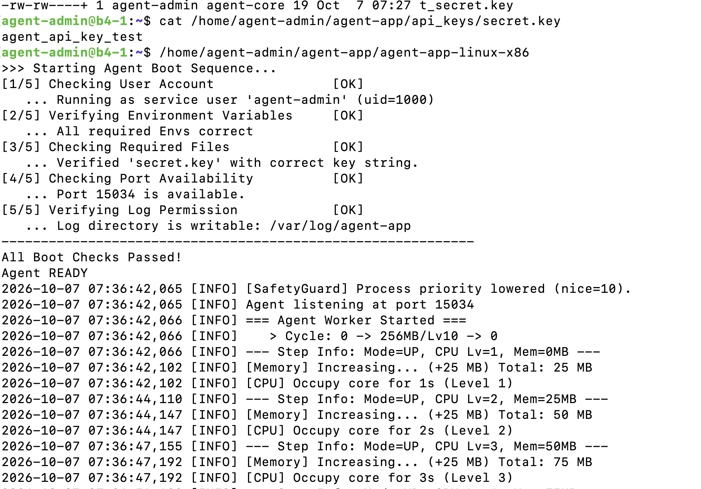

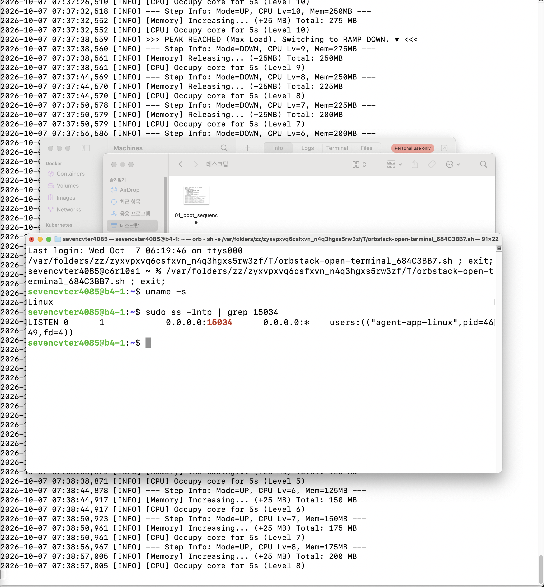

### 참고: 제공 명세와 바이너리 차이

실제 바이너리는 다음을 요구하였다.

```text
AGENT_KEY_PATH=/home/agent-admin/agent-app/api_keys
/home/agent-admin/agent-app/api_keys/secret.key
```

따라서 실행 검증 조건에 맞춰 해당 경로를 구성하였다. 자세한 내용은 `요구사항_수행_내역서.md`에 기록한다.

---

## 6. `monitor.sh`

- [x] Repository에 `bin/monitor.sh` 존재
- [x] Bash로 구현
- [x] 운영 경로 `$AGENT_HOME/bin/monitor.sh` 배치
- [x] 소유자 `agent-dev`
- [x] 그룹 `agent-core`
- [x] 권한 `750 (rwxr-x---)`
- [x] 애플리케이션 프로세스 Health Check `[OK]`
- [x] TCP `15034` Health Check `[OK]`
- [x] UFW 상태 확인
- [x] CPU 사용률 수집
- [x] MEM 사용률 수집
- [x] Root 디스크 사용률 수집
- [x] CPU 임계값 초과 `[WARNING]` 확인
- [x] `/var/log/agent-app/monitor.log` 기록 확인
- [x] `monitor.log` 누적 기록 확인

증거:

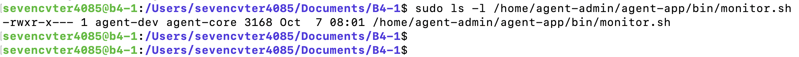

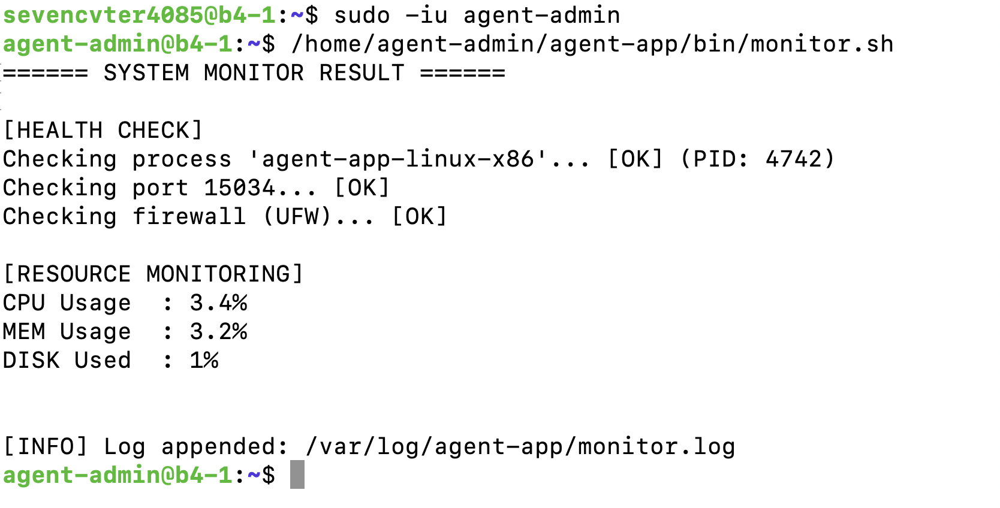

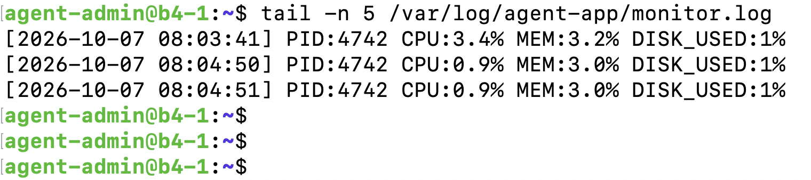

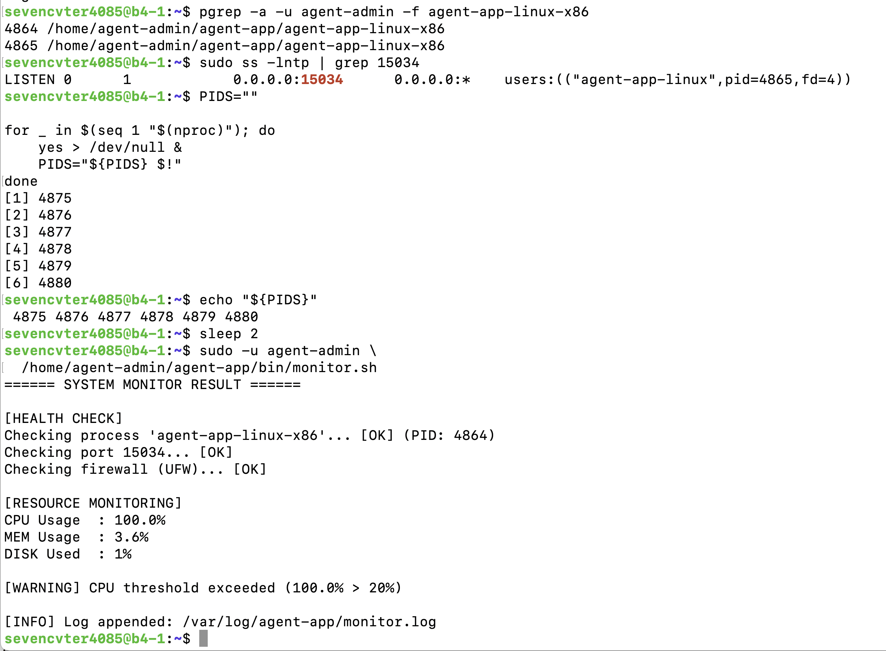

---

## 7. 로그 보존 정책

- [x] `logrotate` 사용
- [x] `size 10M` 설정
- [x] `rotate 10` 설정
- [x] 회전 후 새 로그 `0660 agent-admin:agent-core` 정책 설정
- [x] 강제 회전 테스트 수행
- [x] `monitor.log.1` 생성 확인

증거:

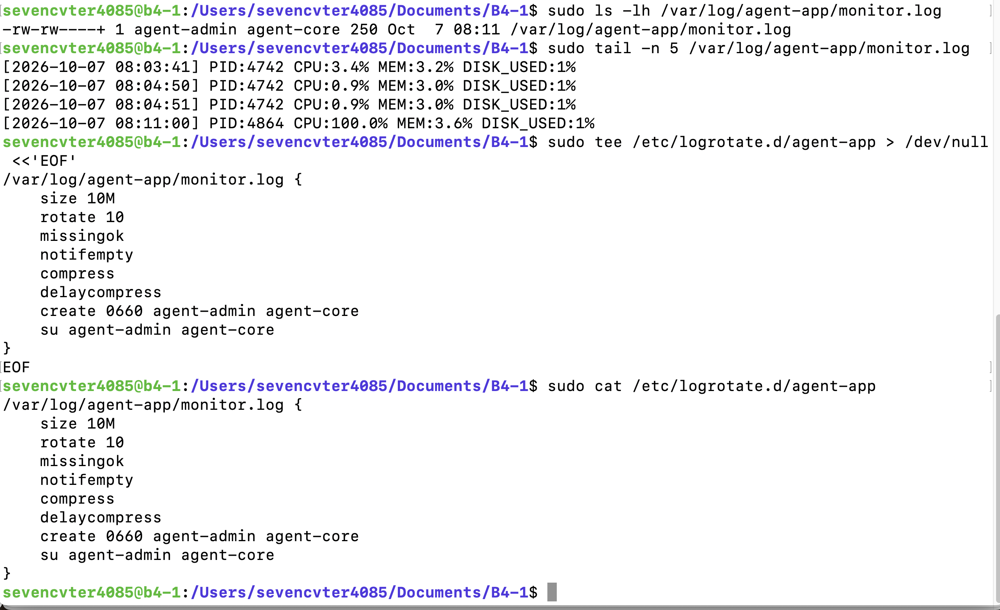

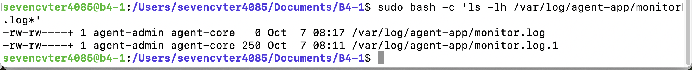

---

## 8. cron 자동 실행

- [x] cron 실행 계정 `agent-admin`
- [x] `monitor.sh` 매분 실행 등록
- [x] `sudo crontab -u agent-admin -l` 등록 내용 확인
- [ ] **1분 후 `monitor.log` 라인 증가를 보여주는 증거 이미지가 GitHub 저장소에 등록되었는지 확인**

등록 증거:

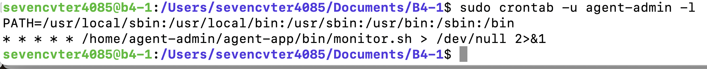

### 최종 제출 전 보완 항목

현재 저장소 확인 기준으로 아래 이미지가 확인되지 않는다.

```text
images/automation/04_cron_auto_execution.png
```

앱을 실행 상태로 둔 뒤 다음 명령으로 자동 누적을 다시 확인한다.

```bash
date
sudo wc -l /var/log/agent-app/monitor.log
sudo tail -n 5 /var/log/agent-app/monitor.log
```

1분 이상 지난 후 동일 명령을 다시 실행하여 라인 수 증가 및 새로운 타임스탬프를 캡처한다.

추가 후 이 항목을 다음과 같이 변경한다.

```markdown
- [x] 1분 후 `monitor.log` 자동 증가 확인
```

그리고 다음 이미지 링크를 추가한다.

```markdown

```

---

## 9. 최종 제출 확인

- [x] 자동화 스크립트 `bin/monitor.sh`
- [x] SSH/방화벽 증거
- [x] 계정/그룹/ACL 증거
- [x] 앱 Boot Sequence 및 LISTEN 증거
- [x] `monitor.sh` 실행/로그/경고 증거
- [x] logrotate 설정/동작 증거
- [x] crontab 등록 증거
- [ ] cron 1분 후 자동 로그 증가 증거 이미지
- [x] 요구사항 수행 내역서 작성
- [x] 필수 증거 체크리스트 작성
- [x] README 작성

**현재 기준 최종 보완 필요 항목은 cron 자동 실행 증거 이미지 1개이다.**
